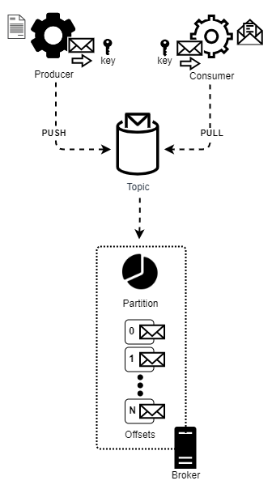

# Kafka Study

Based on Udemy's [Apache Kafka Series - Learn Apache Kafka for Beginners v3](https://www.udemy.com/course/apache-kafka/) 
course.

## What is Kafka?

What is Kafka? A "middleware" tool between sources and targets that centralizes the data transfer between them in the 
form of streams that is manageable and can be monitored.



### Topics

Topics are the main mechanism of communication used to store messages, in the form of streams, created by producers and 
used by consumers. Summarizing, topics hold data.

Comparing with relational databases, you can say that a topic is a table, an insert statement is a producer, and a 
select statement is a consumer. But of course, with a lot of extra features in the between.

Kafka topics are immutable, it means that once data is written to a topic's partition, it cannot be changed.

Data in topics is kept for a limited amount of time. The default is 1 week.

### Partitions

Partitions are logical and physical ways to split the data being handled. This allows load balancing and automatic 
recovery in case of failure. 

Topics are split in partitions. 

Each message is indexed in its partition, this indices are called "offsets".

Data is written to a topic's partition is immutable. You cannot delete(???) or update data.

Messages are ordered inside each partition, but not across partitions. Although there are mechanisms to achieve ordering 
between partitions.

Data can be randomly assigned to the partition (using a round-robin algorithm). To prevent this behavior a key can be 
assigned to a partition and identified when adding data. Messages with the same key will end up in the same partition 
thanks to a hashing calculation.

There is no limit to the partitions amount for a topic.

### Offsets

Offset is the message's incremental ID in each partition.

Different messages in different partitions of the same topic may have the same offset value, but they are not related.

Offsets are not reused, even if its related message have been deleted.  

### Brokers

They are Kafka SERVERS.

They can fail, but Kafka allows producers to recover from brokers failures.

### Producer

What is a producer? Is a program(???) that writes/produces data to a topic.

Producer must know in advance:
    - Which partition to write data to (??? but when explaining partitions the author leads us to believe that the 
      default behavior is Kafka assign the message to a prtition randomly)
    - Which broker has this partition

In case a broker is down, Kafka allows the producer to recover from it.

Producers can assign a key to a message, this key will be related to a specific partition. If no key is assigned, the 
partition will be chosen by a round-robin mechanism (partition 0, then 1, the 2, ...) 

#### Partition Logic

When sending a message to a broker, the producer uses a hash algorithm  (mumur2) applied to the already serialized key 
to identify the partition it will send the message to.


### Consumer

Consumer are responsible for pulling (read/consume) the data from topics.

Since consumers know the topics they are consuming from, they have the information regarding the broker (server).

Consumers don't stop working in case a broker fails.

Messages are consumed in the order they were inserted in the partition (FIFO), but not in the order they were inserted 
between partitions. 

So if: 
```
a) message 1 is pushed first to partition 1, offset 1
b) message 2 is pushed to partition 1, offset 2
c) message 3 is pushed to partition 2, offset 1
```
It is guaranteed that message 1 will be read before than message 2, but not before message 3.

After grabbing the message, the consumer deserializes the Key and Value, so it must know in advance what type of 
deserializer it must use. 
```
The consumer knows what to expect because it is subscribed to a topic of this message. The topic deals with a single 
type of messages, so producers and consumers know what type of serializers and deserializers must use when dealing with 
the topic. 
```

#### Consumer Group

A consumer group is a group of consumers responsible for reading from a topic where each of the consumers is responsible 
for one or more partitions to read. Within a partition group, two consumers cannot read from the same partition. 
However, it is possible to have multiple partition groups consuming from the same topic, and in this case it is possible 
that consumers from different groups consume from the same partition.

Set the group the consumer belongs by setting its "group.id" property.

Why have multiple consumer groups? Responsibility segregation. The same data can be used for different types of 
services. For example: a truck tracking system can have tw services, notification and location, reading from the truck 
location topic. The first is used to notify in case it arrives at some checkpoint, the other to plot the truck in a map 
in real time.

#### Consumer Offsets

Kafka stores the offsets a consumer group is reading in its topic (__consumer_offsets)

### Messages

The data that navigates from producers to consumers.

Messages in each partition are ordered (indexed).

Messages can have keys assigned by producers. These keys are associated to a specific partition.

Messages with the same key will end up in the same partition thanks to a hashing calculation.

#### Producer message

Messages created by producers:
- Key: binary (nullable)
- Value or message content: binary (nullable)
- Compression type: gzip, snappy, lz4, zstd (can be none)
- Headers: key/value (optional)
- Partition + Offset 
- Timestamp 

#### Message Serializer

Kafka does not accept other values than binary, so the Key and Value are serialized by the producer.

There are several serializers in Kafka responsible to transform integers, strings and so on into binary, like the basic 
ones (String, Integer, Float, etc.), and the more complex ones (Apache Avro, Google Protocol Buffers/a.k.a. Protobuf, 
etc.). 

