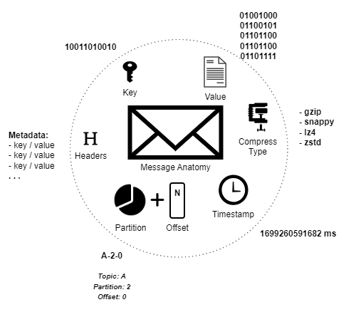
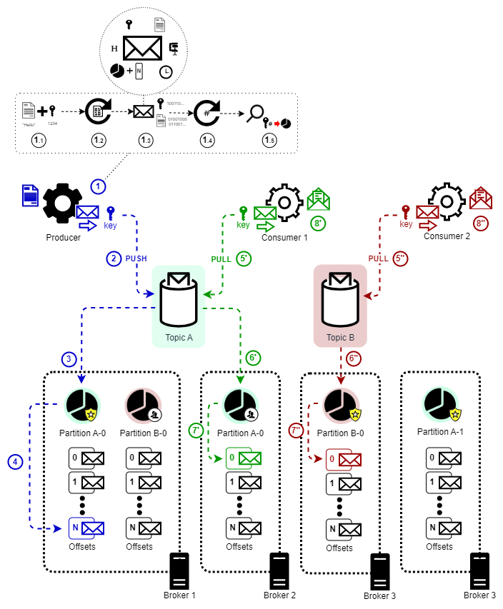

# Kafka Study

Based on Udemy's [Apache Kafka Series - Learn Apache Kafka for Beginners v3](https://www.udemy.com/course/apache-kafka/) 
course.

## Index
- [What is Kafka?](#what-is-kafka)
- [Topics](#topics)
  - [Topic Replication Factor](#topic-replication-factor)
  - [Topic Durability](#topic-durability)
- [Partitions](#partitions)
- [Offsets](#offsets)
- [Brokers](#brokers)
  - [Clusters](#clusters)
  - [Bootstrap Broker](#bootstrap-broker)
  - [Replication](#replication)
  - [In-Sync Replica (ISR)](#in-sync-replica-isr)
  - [Leader for a Partition](#leader-for-a-partition)
- [Producers](#producers)
    - [Partition Logic](#partition-logic)
    - [Producers Acknowledgement](#producers-acknowledgement)
- [Consumers](#consumers)
  - [Consumer Group](#consumer-group)
  - [Consumer Offsets](#consumer-offsets)
  - [Consumer Replica Fetching](#consumers-replica-fetching)
- [Messages](#messages)
  - [Producer Message](#producer-message)
  - [Messages Serializer](#message-serializer)
- [Summary](#summary)

## What is Kafka?

What is Kafka? A "middleware" tool between sources and targets that centralizes the data transfer between them in the 
form of streams that is manageable and can be monitored.


### Topics


**What are topics?** Topics are the main mechanism of communication used to store [Messages](#messages), in the form of 
streams, created by [Producers](#producers) and used by [Consumers](#consumers). Summarizing, topics hold data.

Comparing with relational databases, you can say that a topic is a table, an insert statement is a producer, and a 
select statement is a consumer. But of course, with a lot of extra features in the between.

Kafka topics are **immutable**, it means that once data is written to a topic's partition, **it cannot be changed**. 
Data in topics is kept for a limited amount of time. The default is 1 week.

Topics are split in [Partitions](#partitions).

#### Topic Replication Factor

Kafka keeps topic's data available even when the [Broker](#brokers) responsible for storing it is down. In order to do 
so, a replication factor number must be set, always greater than 1, so another broker takes place in case the main one 
goes down.

#### Topic Durability

TBD

### Partitions


**What are partitions?** Partitions are logical and physical ways to split the data being handled. This allows load 
balancing and automatic recovery in case of failure. 

Each [Message](#messages) is indexed in its partition, these indices are called [Offsets](#offsets).

Data written to a topic's partition is **immutable**. You cannot delete or update this data.

Messages are ordered inside each partition, but not across partitions. Although there are mechanisms to achieve ordering 
between partitions.

Data can be randomly assigned to the partition (using a [round-robin algorithm](https://en.wikipedia.org/wiki/Round-robin_scheduling)). 
To prevent this behavior a key can be assigned to a partition and identified when adding data. Messages with the same 
key will end up in the same partition thanks to a hash calculation.

There is no limit on how many partitions can fit into a topic.

### Offsets


**What are offsets?** Offset is the [Message's](#messages) incremental ID in each [Partition](#partitions).

Different messages in different partitions of the same [Topic](#topics) may have the same offset value, but they are not 
related.

Offsets are not reused, even if its related message had been removed.  

### Brokers


**What are brokers?** They are Kafka SERVERS identified by an ID. They're called "brokers" because send and receive 
data.

They can fail, but Kafka allows [Producers](#producers) to recover from brokers failures.

They contain (certain) [topic's](#topics) [Partitions](#partitions).

#### Clusters

**What are Kafka Clusters?** A set of multiple [Brokers](#brokers) sharing [Topic](#topics) [Partitions](#partitions). 
Clusters may have any amount of brokers allowing horizontal scaling and spreading data throughout the cluster.

Each broker does not have all the data, but only the one it is intended to have.

#### Bootstrap Broker

When connecting to one [Broker](#brokers), the client becomes aware of the other brokers belonging to a 
[Cluster](#clusters) and can connect to any of them. This first broker the client connects is called "Bootstrap Broker".

The lifecycle of a client connection is quite simple:
1. A client connects to any broker of the cluster;
2. This "Bootstrap Broker" sends a list of all other brokers in the cluster;
3. The client now uses this information to connect to the broker that has the [Topic](#topics) and [Partition](#partitions) it needs;

#### Replication

The [Topic Replication Factor](#topic-replication-factor) allows data redundancy between [Brokers](#brokers) in order to 
prevent it from being unavailable. If a broker is down, at least one another can serve the data, and all pushes and 
pulls to and from the previous one's [Topics](#topics) must be redirected to the new one.


#### In-Sync Replica (ISR)

If data can be replicated fast enough in order for a second [Broker](#brokers) to have all data from the original one, 
this broker is called an "in-sync replica" or simply **ISR**.

It allows [Producers](#producers) and [Consumers](#consumers) to keep pushing and pulling Messages. Also, consumers can 
be configured for fetching from a different broker, even if the [Leader for a Partition](#leader-for-a-partition) is not 
down (See [Consumer Replica Fetching](#consumers-replica-fetching)).

#### Leader for a Partition

Only one [Broker](#brokers) can serve the [Partition](#partitions) at a time, it is called the "Leader for a Partition",
and [Producers](#producers) can only send [Messages](#messages) to this broker regardless how many 
[In-Sync Replica](#in-sync-replica-isr) exist. For [Consumers](#consumers), the **default**  behavior is the same, they consume from the 
Leader for a Partition, but for version 2.4 and beyond, this default setting can be changed. See 
[Consumer Replica Fetching](#consumers-replica-fetching) for more details.

### Producers


**What are producers?** Is a program that writes/produces data to a [Topic](#topics).

Producers must know in advance:
- Which [Partition](#partitions) to write data to
- Which [Broker](#brokers) has this partition

Producers can only send [Messages](#messages) to the broker [Leader for a Partition](#leader-for-a-partition).

In case a broker is down, Kafka allows the producer to recover from it by routing to an 
[In-sync Replica](#in-sync-replica-isr) broker.

Producers can assign a key to a message, this key will be related to a specific partition. If no key is 
assigned, the partition will be chosen by a [round-robin](https://en.wikipedia.org/wiki/Round-robin_scheduling) 
mechanism (partition 0, then 1, the 2, ...) 

#### Partition Logic

When sending a message to a [Broker](#brokers), the producer uses a hash algorithm 
([mumur2](https://en.wikipedia.org/wiki/MurmurHash)) applied to the already serialized key to identify the 
[Partition](#partitions) it will send the [Message](#messages) to.


#### Producers Acknowledgement

TBD

### Consumers


**What are consumers?** Consumers are responsible for pulling (read/consume) the data from [Topics](#topics).

Since consumers know the topics they are consuming from, they have the information regarding the [Broker](#brokers) 
(server).

[Messages](#messages) are consumed in the order they were inserted in the [Partition](#partitions) (FIFO), but not in
the order they were inserted between partitions.

Consumers, by default, fetch Messages from the broker [Leader for a Partition](#leader-for-a-partition), but since 
version 2.4+ this behavior can be configured.

Consumers don't stop working in case a broker fails, it will pull from an [In-sync Replica Broker](#in-sync-replica-isr) 
instead.

So if: 
```
a) message 1 is pushed first to partition 1, offset 1
b) message 2 is pushed to partition 1, offset 2
c) message 3 is pushed to partition 2, offset 1
```
It is guaranteed that message 1 will be read before message 2, but not before message 3.

After grabbing the message, the consumer deserializes the Key and Value, so it must know in advance what type of 
deserializer it must use. 

**NOTE:** The consumer knows what to expect because it is subscribed to a topic of this message. The topic deals with a 
single type of messages, so [Producers](#producers) and consumers know what type of serializers and deserializers must 
use when dealing with the topic.

The topic must not change the type of the Key and Message after created. Doing so will prevent consumers from being able
to deserialize the messages. In case of changing topic's messages types, a new topic must be created and only then 
redirect the consumers to consume from this new topic.

#### Consumer Group

A consumer group is a group of [Consumers](#consumers) responsible for reading from a [Topic](#topics) where each 
consumer is responsible for one or more [Partitions](#partitions) to read. Within a consumer group, two consumers cannot 
read from the same partition. However, it is possible to have multiple consumer groups consuming from the same topic, 
and in this case it is possible that consumers from different groups consume from the same partition. If there are too 
many consumers in the group for the amount of partitions in a topic, then the extra consumer becomes **inactive**.


Set the group the consumer belongs by setting its "group.id" property.

Why have multiple consumer groups? **Responsibility segregation**. The same data can be used for different types of 
services. For example: a truck tracking system can have two services, notification and location, reading from the truck 
location topic. The first is used to notify in case it arrives at some checkpoint, the other to plot the truck in a map 
in real time.

#### Consumer Offsets

[Consumer groups](#consumer-group) periodically "commit" the [Offsets](#offsets) it has completed reading in order to be 
able to continue from the last read offset in case of any error. Kafka keeps track of each consumer group offset reading 
storing this checkpoint in a specific [Topic](#topics) called _\_\_consumer_offsets_.

#### Consumers Replica Fetching

Since version 2.4, consumers can be configured to fetch messages from the nearest [Broker](#brokers), as long as it is
an [In-sync Replica](#in-sync-replica-isr).

It allows to improve latency and reduce costs in case consumers and brokers are close or even in the same data center, 
for example. 

### Messages


The data that navigates from [Producers](#producers) to [Consumers](#consumers).

Messages in each [Partition](#partitions) are ordered (indexed). This order index is called [Offset](#offsets).

Messages can have keys assigned by producers. These keys are associated to a specific partition.

Messages with the same key will end up in the same partition thanks to a hashing calculation 
([mumur2](https://en.wikipedia.org/wiki/MurmurHash)).

#### Producer message



Messages created by producers:
- Key: binary (nullable)
- Value or message content: binary (nullable)
- Compression type: gzip, snappy, lz4, zstd (can be none)
- Headers: key/value (optional)
- Partition + Offset 
- Timestamp 

#### Message Serializer

Kafka does not accept other values than binary, so the Key and Value are serialized by the [Producer](#producers).

There are several serializers in Kafka responsible to transform these information into binary, like the basic 
ones (String, Integer, Float, etc.), and the more complex ones ([Apache Avro](https://avro.apache.org/docs/), 
[Google Protocol Buffers/a.k.a. Protobuf](https://protobuf.dev/), etc.).

## Summary

TBD



